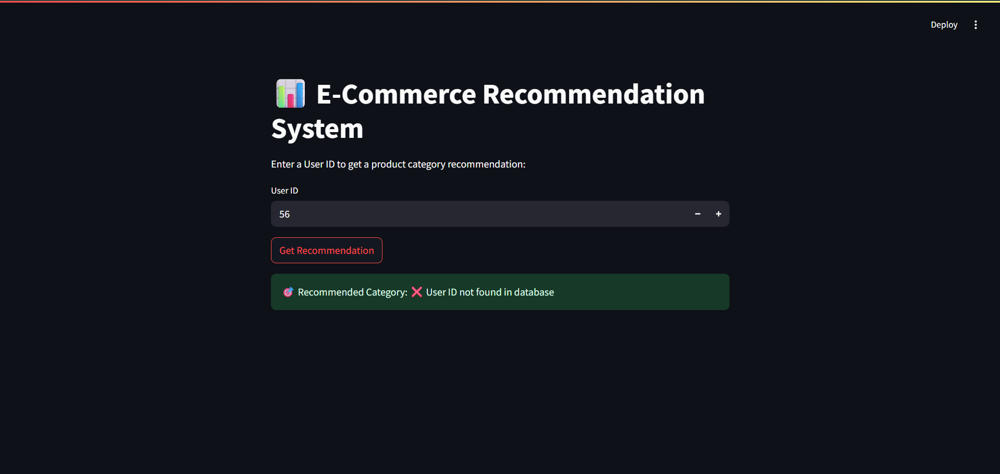
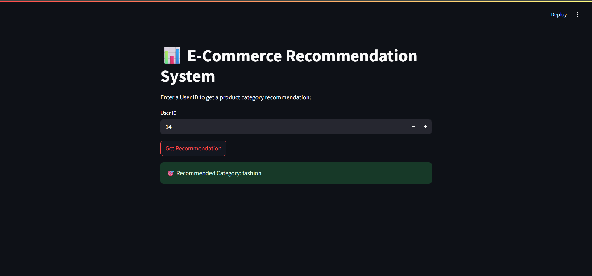
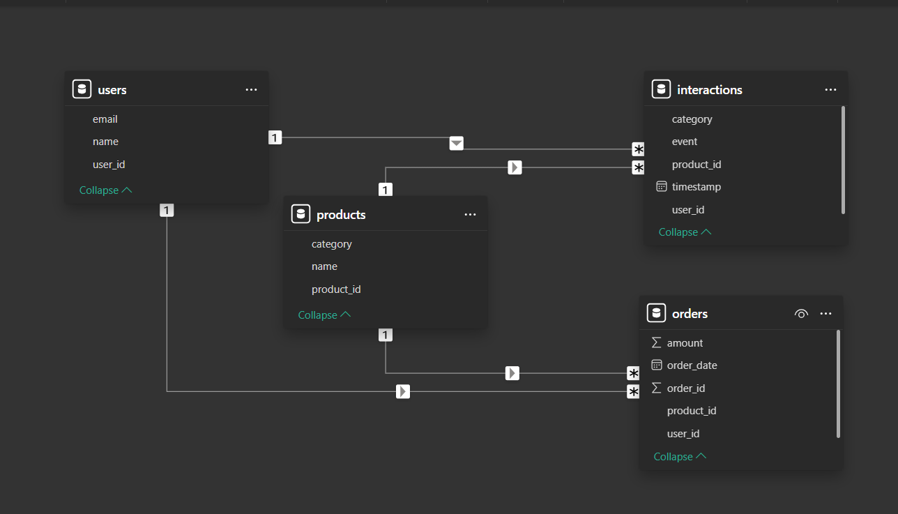
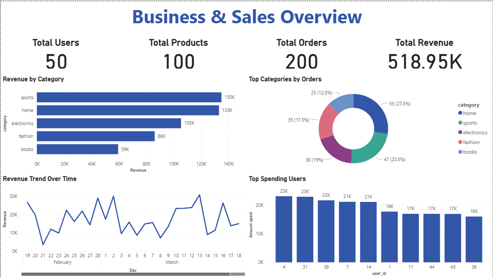
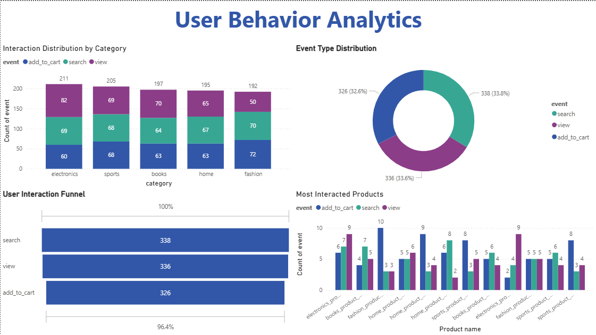

# Ecommerce Recommendation System Using Hybrid Databases

## Overview
This project is a **hybrid database-powered e-commerce recommendation system**. It combines **MySQL** (for structured user, product, and order data) and **MongoDB** (for user interactions like views, searches, and cart events) to generate personalized product category recommendations using **Machine Learning (Logistic Regression)**.  

The system also features a **Streamlit interface** for interactive predictions and can be visualized using **Power BI** for deeper insights.

---

## Features
- Stores e-commerce data in **MySQL** and **MongoDB**.  
- **Data extraction** and **feature engineering** pipelines prepare the dataset for ML.  
- Machine Learning model predicts the most likely **product category** a user will interact with.  
- Streamlit interface for easy **user interaction and category prediction**.  
- Supports **offline analysis** using CSV exports from both databases.  
- Visualizable using **Power BI** for dashboards of users, orders, products, and interactions.

---

## Tech Stack
- **Python** – Main programming language  
- **MySQL** – Structured database for users, products, and orders  
- **MongoDB** – NoSQL database for interactions  
- **Pandas / Scikit-learn** – Data processing and ML  
- **Streamlit** – Frontend UI for predictions  
- **Power BI** – Dashboard visualizations (optional)  

---

## Screenshots

| Invalid User ID | Valid User ID |
|-----------------|---------------|
|  |  |

---
## Power BI Dashboard

Interactive dashboards were created using :contentReference[oaicite:0]{index=0} to analyze sales trends, customer interactions, and recommendation-related insights.

### Dashboard 1 — Business & Sales Overview
- KPI cards for Total Users, Orders, Revenue, and Products
- Revenue by Category
- Orders Trend Over Time
- Top Categories by Orders
- Top Spending Users

### Dashboard 2 — User Behavior Analytics
- Interaction Distribution by Category
- Event Type Distribution
- Most Interacted Products

### Data Relationships
Relationships were created between:
- Users ↔ Orders
- Users ↔ Interactions
- Products ↔ Orders
- Products ↔ Interactions

to enable cross-table analytics and dashboard visualizations.

## Dashboard Screenshots

### Model View

### Dashboard 1 — Business & Sales Overview

### Dashboard 2 — User Behavior Analytics

---

## Future Improvements
- Upgrade Streamlit frontend with multi-page UI.
- Real-time recommendation updates when database changes.
- Deploy to Heroku / Streamlit Cloud for online access.
